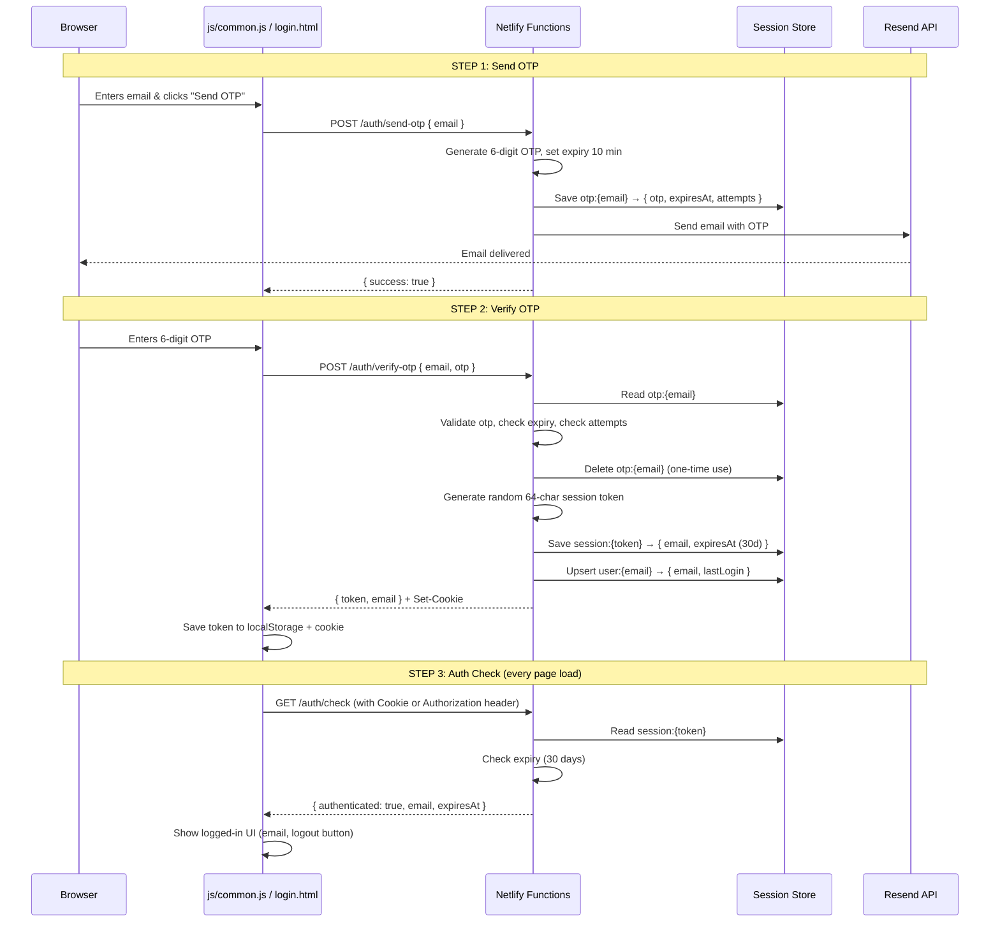
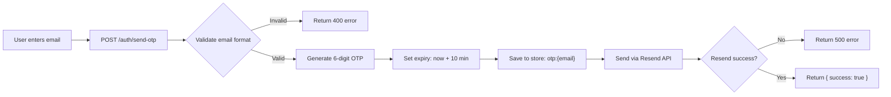
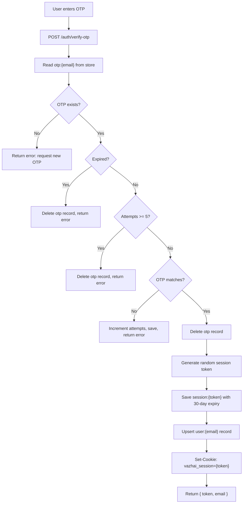
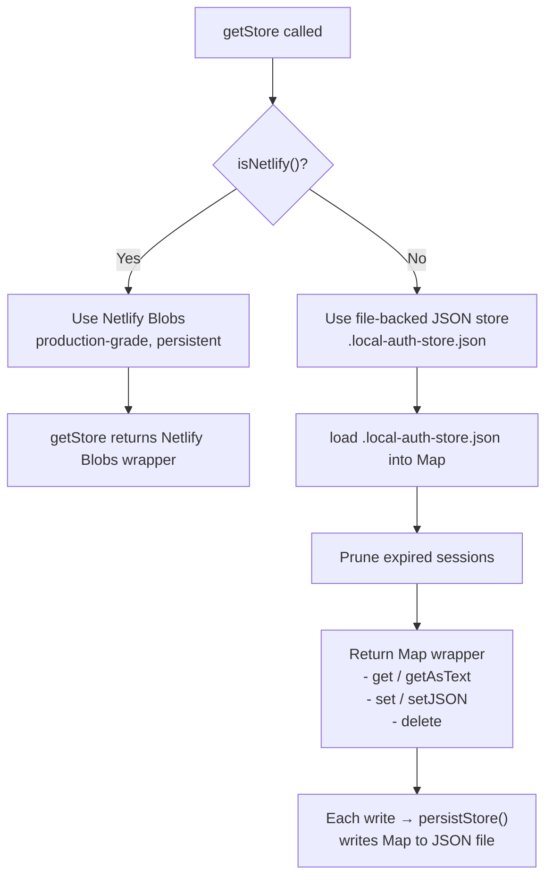
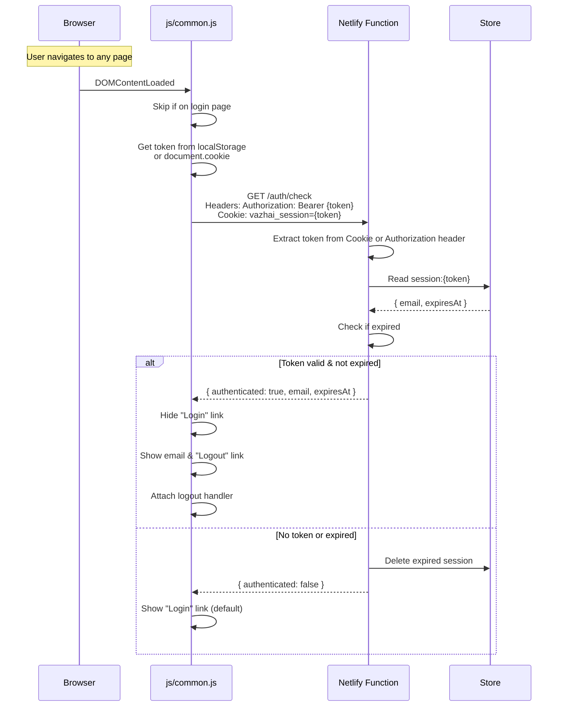
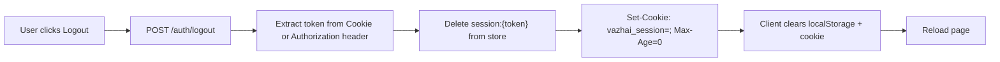
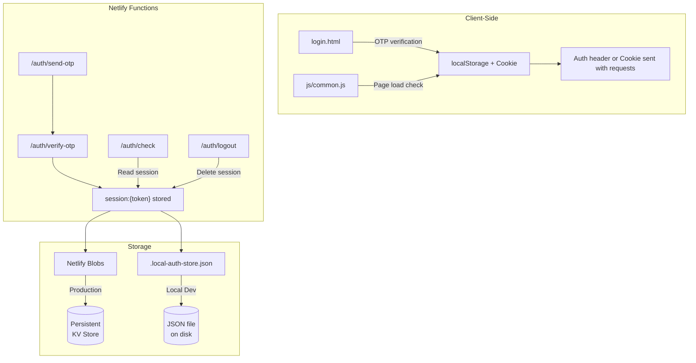

# Vazhai Authentication System — Architecture Overview

## Table of Contents

1. [Overview](#overview)
2. [Flow Diagram](#flow-diagram)
3. [Step 1: Send OTP](#step-1-send-otp)
4. [Step 2: Verify OTP & Create Session](#step-2-verify-otp--create-session)
5. [Session Persistence](#session-persistence)
   - [Local (Dev)](#local-dev)
   - [Netlify (Production)](#netlify-production)
6. [Auth Check (Page Load)](#auth-check-page-load)
7. [Logout](#logout)
8. [File Map](#file-map)

---

## Overview

The authentication system uses **email-based OTP login**. No passwords are involved. The flow is:

1. User enters their email → receives a 6-digit OTP via email (Resend API).
2. User enters the OTP → server verifies it → creates a **session token**.
3. The session token is stored in a **cookie + localStorage** on the client, and in **persistent server-side storage**.
4. On every page load, `js/common.js` calls `/auth/check` to validate the session.
5. The session is valid for **30 days**.

---

## Flow Diagram



---

## Step 1: Send OTP

**Endpoint:** `POST /auth/send-otp`  
**File:** `netlify/functions/auth-send-otp.js`



**Key details:**
- OTP expires in **10 minutes**.
- Maximum **5 failed attempts** per OTP.
- OTP is deleted after successful verification (one-time use).
- In local dev, the email is still sent via Resend (requires `RESEND_API_KEY` in `.env`).

**Store key format:** `otp:{normalizedEmail}`

```json
{
  "otp": "482916",
  "expiresAt": 1780719000000,
  "attempts": 0
}
```

---

## Step 2: Verify OTP & Create Session

**Endpoint:** `POST /auth/verify-otp`  
**File:** `netlify/functions/auth-verify-otp.js`



**Key details:**
- Session token is a **64-character hex string** (32 random bytes via `crypto.randomBytes`).
- Session expires in **30 days** (`SESSION_DURATION_MS = 30 * 24 * 60 * 60 * 1000`).
- The `Set-Cookie` header includes `Max-Age=2592000` (30 days in seconds) and `SameSite=Lax`.

**Store key formats:**

```
session:{token} → { email, expiresAt, createdAt }
user:{email}    → { email, firstLogin, lastLogin }
```

---

## Session Persistence

**File:** `netlify/functions/auth-store.js`

The store automatically detects the environment and uses the appropriate backend:



### Local (Dev)

```javascript
// File: .local-auth-store.json
{
  "session:a1b2c3...": {
    "email": "user@example.com",
    "expiresAt": 1783311657244,
    "createdAt": 1780719657244
  },
  "user:user@example.com": {
    "email": "user@example.com",
    "firstLogin": "2026-06-06T09:00:00.000Z",
    "lastLogin": "2026-06-06T09:00:00.000Z"
  }
}
```

**Key behaviours:**
- On first access, loads the entire JSON file into an in-memory `Map`.
- Every `setJSON`, `set`, or `delete` immediately writes the full Map back to disk (`persistStore()`).
- On module load, expired sessions are automatically pruned (`pruneExpired()`).
- If the JSON file is corrupted, it logs an error and starts fresh with an empty Map.

### Netlify (Production)

Netlify Blobs (`@netlify/blobs`) is a fully managed key-value store. It is:
- **Persistent** — survives deploys, restarts, and scaling events.
- **Global** — available across all function instances.
- **Scoped** — each deployment has its own blob store namespace.

---

## Auth Check (Page Load)

**Endpoint:** `GET /auth/check`  
**File:** `netlify/functions/auth-check.js`  
**Client:** `js/common.js` (IIFE runs on all pages except login)



**Where the UI updates happen** (`common-bottom.html` typically includes these elements):

| Element ID | Purpose |
|---|---|
| `page-login-link` | The "Login" link shown when logged out |
| `page-loggedin-email` | Shows the user's email when logged in |
| `page-logout-link` | The "Logout" link shown when logged in |

---

## Logout

**Endpoint:** `POST /auth/logout`  
**File:** `netlify/functions/auth-logout.js`



**Client-side cleanup:**
```javascript
localStorage.removeItem('vazhai_session');
document.cookie = 'vazhai_session=; Path=/; Max-Age=0; SameSite=Lax';
window.location.reload();
```

---

## File Map

| File | Purpose |
|---|---|
| `netlify/functions/auth-store.js` | Storage abstraction — Netlify Blobs (prod) or file-backed JSON (dev) |
| `netlify/functions/auth-send-otp.js` | Generates OTP, stores it, sends via Resend |
| `netlify/functions/auth-verify-otp.js` | Verifies OTP, creates session token, stores it, sets cookie |
| `netlify/functions/auth-check.js` | Validates session token on page load |
| `netlify/functions/auth-logout.js` | Deletes session from store, clears cookie |
| `js/common.js` | Client-side auth check on every page (IIFE at bottom) |
| `login.html` | Login page UI with email + OTP forms |
| `.local-auth-store.json` | Local dev persistent store (auto-generated, gitignored) |
| `netlify.toml` | Redirects `/auth/*` URLs to the corresponding Netlify functions |

---

## Environment Variables

| Variable | Required | Description |
|---|---|---|
| `RESEND_API_KEY` | Yes | API key for sending OTP emails via Resend |
| `OTP_FROM_EMAIL` | No | Sender email address (default: `do-not-reply@vazhai.in`) |
| `SITE_URL` | Local dev only | Used for local testing (e.g. `http://localhost:8888`) |

---

## Summary



The key insight is: **the session token is stored server-side**, not just client-side. The client only holds a reference (cookie/token) to look up the session. This means revoking a session on the server (e.g. via logout) truly invalidates it, and the 30-day expiry is enforced server-side regardless of what the client does.